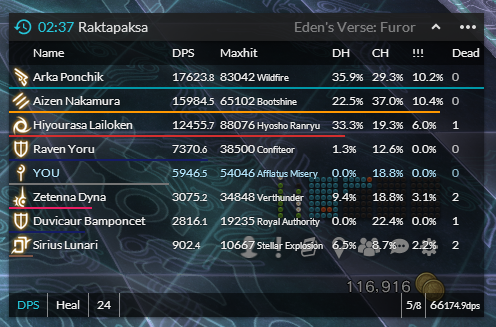
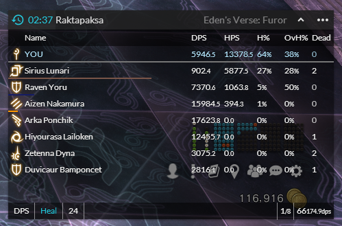

# Advanced Combat Tracker Setup
This is a step by step guide that should be able to help anyone install ACT and a nice overlay for it for their own improvement. These settings also work for fflogs uploading ([here's the downloader for that](https://www.fflogs.com/client/download/))

**If you find any issues with this guide, please create a [new issue](https://github.com/zeraphie/act-setup-guide/issues) or a new [Pull Request](https://github.com/zeraphie/act-setup-guide/pulls)**

*Note: This only has been tested on Windows 10*

***Always remember to start ACT as administrator!***

## Installing ACT
1. Go to the [ACT Page](https://advancedcombattracker.com/download.php) and download the advanced combat tracker
2. Download the [FFXIV Plugin](http://advancedcombattracker.com/includes/page-download.php?id=66)
3. `[Optional]` If you're not worried about FFLogs you can use the `Parse Mode` of `Memory` but it is inaccurate (it'll at least give you a starting point!). If you want to set it up accurately however, check the [Usage with FFLogs](#usage-with-fflogs) section
4. `[Optional]` Remove the FFXIV Overlay (Top right in ACT), you may also need to do the following to remove the large HP bar that gets added in (sometimes it gets re-added with an update to ACT)
    1. Go to Plugins
    2. Go to FFXIV Overlay Settings
    3. On each tab (Target, Focus Target, Hover Target, Target of Target) check the `Hide Overlay` checkbox
5. Go to Options
    1. Main Table/Encounters -> General
        1. Change "Number of seconds to wait after the last combat action to begin a new counter." to 60 (this is a setting required for FFLogs as well)
    2. `[Optional]` Output Display -> Text Export Settings - Sets up pasting parsing to a readable single line
        1. Click on add preset in the top right
        2. Click on "Edit Directly" under "Allies Formatting" and paste the following
            1. `({duration}) {title}: {ENCDPS} | {maxhit}`
            2. Press Save
        3. Click on "Edit Directly" under "Per-combat Formatting" and paste the following
            1. <code>&nbsp;| {NAME5} -> {ENCDPS}</code> (The initial space is important too!)
            2. Press Save
        4. Click "Add Text Format Preset"
        5. Change the "Clipboard Formatting" option to the newly created setting which will be as below
            1. `(EncDPS) " | {NAME5} -> {ENCDPS}`
6. Go to Plugins
    1. Click "Browse..."
    2. Find the dll file that you downloaded as the FFXIV Plugin (it'll be FFXIV_ACT_Plugin.dll as default)
    3. Click on Add/Enable Plugin
    4. Go to FFXIV Settings
        1. Go to Parse Options
        1. Check Disable Damage Shield estimates
        1. Check Disable Combine Pets with Owner
7. You should now be able to see your damage automatically updating in the Main window

## Setting ACT to default run as Admin
The following steps will set the shortcut created for ACT to always run as admin, you will need to confirm the window each time it opens as a result.

1. Right click the shortcut
2. Click on Properties
3. On the Shortcut tab, click on Advanced
4. Check "Run as Administrator" and OK
5. Apply the changes and click on Continue when asked

## Usage with FFLogs
In order to setup ACT to be used with fflogs you need to make sure that your parse mode is set to `Network`. In order to do this, you also need to make sure that it passes through the firewall as follows

1. Click on "Allow an app or feature through Windows Firewall"
2. Click on "Change Settings"
3. Click on "Allow another app..."
4. Click on "Browse..."
    1. Navigate to where you installed ACT (This is usually in C:\Program Files (x86)\Advanced Combat Tracker)
    2. Enable "Advanced Combat Tracker.exe"
5. Check the Private setting as well as the Public setting for ACT
6. Click "OK"
7. Exit Firewall and restart (preferably your computer)

## Installing the Overlay
1. Download the [Overlay Plugin](https://github.com/hibiyasleep/OverlayPlugin/releases/tag/0.3.3.11)
3. Download the zip file from here at the top of the page http://billyvg.github.io/OverlayPlugin-themes/
2. Right click both zip files, click on properties, then check "Unblock" and apply
3. Add it to ACT then navigate to it in the plugins page
4. Click on the mini parse and click on the triple dot next to the url box, and navigate to the extracted overlay plugin themes directory, and select the html file that you like, I'd recommend the `Hibiyasleep_Kagerou_pointer` theme which you'll find some easy to follow instructions below
    
### The Kagerou Overlay
The `Hibiyasleep_Kagerou_pointer` theme for the overlay provides a nice and customisable version that doesn't really obstruct your view of the game, and in particular has highly interchangeable columns and the ability to create new tabs to switch to for different types of content or data that you want to keep track of

I've also added an [export](export.txt) file that comes with some very handy settings to get you up and running quickly! To use this export, follow the instructions below

1. Click on the three vertical dots on the top right hand of the overlay
2. Click on the cog
3. Click on the first dropdown you see on the right hand side, change the overlay to english
4. Click on the button in the top right of the settings to save
5. (Optional) Go to Import/Export and paste in the code from the [export](export.txt) file and click on import

#### DPS Kagerou Example

#### Healer Kagerou Example

